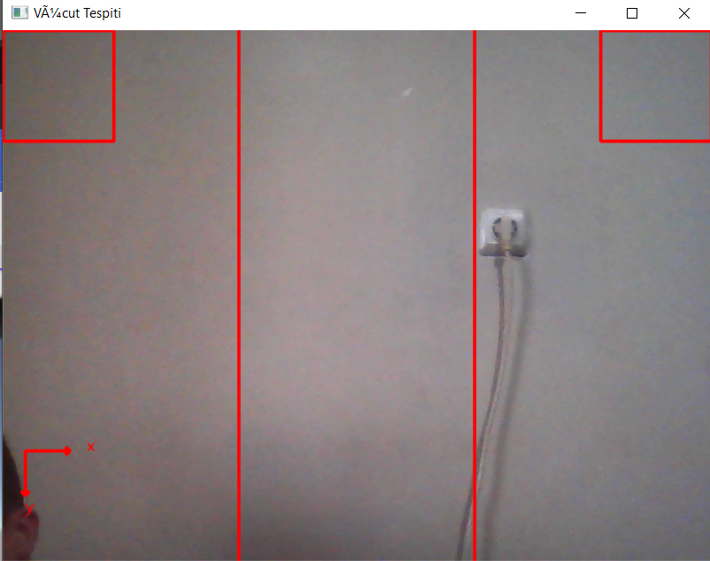

# **Endless Runner Game Using Body Movements**
This project allows you to control an endless runner game using body movements detected through a camera. The project consists of two stages:

### **Stage 1: Body Movement Detection with Python and OpenCV**
#### Requirements
- Python 3.x
- Mediapipe
- OpenCV
- Socket (for communication with Unity)

### **Installation**

```bash
   pip install socket mediapipe opencv-python 
```

### **Usage**
In this stage, body positions and coordinates are captured via the camera. The system detects which lane the body is in and sends this information to the Unity game engine through a defined port. Additionally, raising your right hand will resume the game, and raising your left hand will pause it.

```python
import cv2
import mediapipe as mp
import socket

# Mediapipe için gerekli modüller 
mp_drawing = mp.solutions.drawing_utils # Görüntüler üzerinde çizim yapmayı sağlayan modül. (Çizim için kullanılır)
mp_pose = mp.solutions.pose  # Vücut pozisyonunu tespit etmek için kullanılan modül.

# Video yakalama başlat
ekranGenislik = 640
ekranYukseklik = 480

cap = cv2.VideoCapture(0)
cap.set(cv2.CAP_PROP_FRAME_WIDTH, ekranGenislik)
cap.set(cv2.CAP_PROP_FRAME_HEIGHT, ekranYukseklik)

# Unity ile haberleşme işlemi
sock = socket.socket(socket.AF_INET, socket.SOCK_DGRAM)
serverAddressPort = ("127.0.0.1", 5052)

# Vücut noktaları tespiti sınıfı kullanarak vücut tespiti işlemlerini başlatıyoruz.
with mp_pose.Pose(min_detection_confidence=0.7, min_tracking_confidence=0.4) as pose:
    while cap.isOpened():
        # Video çerçevesini oku
        ret, frame = cap.read()
        frame = cv2.flip(frame, 1)

        # Çerçeveyi BGR'den RGB'ye dönüştür
        rgb_frame = cv2.cvtColor(frame, cv2.COLOR_BGR2RGB)

        # RGB görüntüyü işle ve vücut pozisyonunu tespit et
        results = pose.process(rgb_frame)

        # Vücut pozisyonu başarılıysa
        if results.pose_landmarks:
            # Vücut pozisyonu noktalarını çerçeve üzerine çiz
            mp_drawing.draw_landmarks(frame, results.pose_landmarks, mp_pose.POSE_CONNECTIONS)

            # Kırmızı çizgilerin başlangıç ve bitiş pozisyonları
            # Çizgi 1: (213,0) - (213,480)
            # Çizgi 2: (426,0) - (426,480)
            cv2.line(frame, (213, 0), (213, 480), (0, 0, 255), 2)
            cv2.line(frame, (426, 0), (426, 480), (0, 0, 255), 2)


            # Sol üst köşeye bir kutucuk
            cv2.rectangle(frame, (0, 0), (100, 100), (0, 0, 255), 2)  # Sol üst köşe (0, 0), sağ alt köşe (100, 100), kalınlık 2, kırmızı renkte kutucuk

            # Sağ üst köşeye bir kutucuk
            cv2.rectangle(frame, (540, 0), (640, 100), (0, 0, 255), 2) # Sol üst köşe (540, 0), sağ alt köşe (640, 100), kalınlık 2, kırmızı renkte kutucuk

            # # X ekseni için ok çiz
            cv2.arrowedLine(frame, (20, 380), (60, 380), (0, 0, 255), 2)
            cv2.putText(frame, 'x', (75, 380), cv2.FONT_HERSHEY_SIMPLEX, 0.5, (0, 0, 255), 1, cv2.LINE_AA)

            # Y ekseni için ok çiz
            cv2.arrowedLine(frame, (20, 380), (20, 420), (0, 0, 255), 2)
            cv2.putText(frame, 'y', (20, 435), cv2.FONT_HERSHEY_SIMPLEX, 0.5, (0, 0, 255), 1, cv2.LINE_AA)


            # Vücut nokta koordinatlarını alma ve gönderme işlemi
            vucutKoordinatSozlugu = {"solOmuz":results.pose_landmarks.landmark[12], "sagOmuz":results.pose_landmarks.landmark[11], "solKalca":results.pose_landmarks.landmark[24], "sagKalca":results.pose_landmarks.landmark[23], "solGoz":results.pose_landmarks.landmark[8], "sagGoz":results.pose_landmarks.landmark[7], "burun":results.pose_landmarks.landmark[0], "solElBilegi":results.pose_landmarks.landmark[16], "sagElbilegi":results.pose_landmarks.landmark[15]}


            #Hangi durumda olduğunu taşıdığımız degisken
            hangiDurumda = ""
            bilekDurum = None
            yollanacakVeri = ""

            #Solda olma durumu
            if((vucutKoordinatSozlugu["solOmuz"].x * ekranGenislik < 213 and vucutKoordinatSozlugu["sagOmuz"].x * ekranGenislik <213) or (vucutKoordinatSozlugu["sagOmuz"].x * ekranGenislik < 213) or (vucutKoordinatSozlugu["sagGoz"].x * ekranGenislik < 213)):
                hangiDurumda = "1"

            #Ortada olma durumu
            elif((vucutKoordinatSozlugu["solGoz"].x * ekranGenislik>= 213 and vucutKoordinatSozlugu["burun"].x  * ekranGenislik >= 213 and vucutKoordinatSozlugu["sagGoz"].x * ekranGenislik >= 213) or (vucutKoordinatSozlugu["solGoz"].x * ekranGenislik <= 426 and vucutKoordinatSozlugu["burun"].x * ekranGenislik <= 426 and vucutKoordinatSozlugu["sagGoz"].x * ekranGenislik <= 426)):
                hangiDurumda = "2"

            #Sağda olma durumu 
            if((vucutKoordinatSozlugu["solOmuz"].x * ekranGenislik > 426 and vucutKoordinatSozlugu["sagOmuz"].x * ekranGenislik > 426) or (vucutKoordinatSozlugu["solOmuz"].x * ekranGenislik > 426) or (vucutKoordinatSozlugu["solGoz"].x * ekranGenislik > 426)):
                hangiDurumda = "3"


            #Sol bileğin kutucuk içerisinde olması 0 durumu
            if(vucutKoordinatSozlugu["solElBilegi"].x * ekranGenislik < 100 and vucutKoordinatSozlugu["solElBilegi"].y * ekranYukseklik < 100):
                bilekDurum = "0"
            #Sağ bileğin kutucuk içerisinde olması 1 durumu
            elif(vucutKoordinatSozlugu["sagElbilegi"].x * ekranGenislik > 540 and vucutKoordinatSozlugu["sagElbilegi"].y * ekranYukseklik < 100):
                bilekDurum = "1"
            if( (vucutKoordinatSozlugu["sagElbilegi"].x * ekranGenislik > 540 and vucutKoordinatSozlugu["sagElbilegi"].y * ekranYukseklik < 100) and (vucutKoordinatSozlugu["solElBilegi"].x * ekranGenislik < 100 and vucutKoordinatSozlugu["solElBilegi"].y * ekranYukseklik < 100) ):
                bilekDurum = "2"

            
            if(bilekDurum is None):
                yollanacakVeri = hangiDurumda + "," + "-1"
                sock.sendto(str.encode(yollanacakVeri), serverAddressPort)
            
            else:
                yollanacakVeri = hangiDurumda + "," + bilekDurum
                sock.sendto(str.encode(yollanacakVeri), serverAddressPort)

            #sock.sendto(str.encode(hangiDurumda), serverAddressPort)

            #print(f"Vücut hangi durumda: {yollanacakVeri}\n")

            hangiDurumda = ""
            yollanacakVeri = ""
        # Görüntüyü göster
        cv2.imshow('Vücut Tespiti', frame)

        # Çıkış için 'q' tuşuna bas
        if cv2.waitKey(1) & 0xFF == ord('q'):
            break

# Video yakalamayı ve pencereyi kapat
cap.release()
cv2.destroyAllWindows()
```

### **Demo**
In the image below, you can see the live feed from the camera with three vertical strips (lanes) labeled 1, 2, and 3. The position of the body within these strips determines the data sent to Unity. When the body is detected in strip 1, it sends a signal to move left; in strip 2, it stays in the middle; and in strip 3, it moves right.



### **Stage 2: Unity Endless Runner Game**

In this stage, an endless runner game is developed in Unity. The game can be controlled both by keyboard and body movements. When body movement control is selected, the Python script from Stage 1 starts automatically. The game avatar moves left and right and avoids obstacles based on the detected body movements.

### **Unity Setup**
1.Open your Unity project.
2.Import the necessary assets and scripts.
3.Integrate the Python communication script to handle input from the body movement detection.

### **How to Play**
**1.Using Keyboard**
- Use arrow keys to move left, right and space bar to jump.

**2.Using Body Movements**
- Stand in front of the camera and use your body movements to control the character.
- Move to the left strip (1) to make the character move left.
- Stay in the middle strip (2) to keep the character in the center.
- Move to the right strip (3) to make the character move right.
- Raise your right hand to stop the game.
- Raise your left hand to continue the game.

### Demo
Here are some demonstrations of the different control methods and features:

1. ***Keyboard Control***
    
2. ***Body Movement Control***
    
3. ***Resume and Continue***
    


### **License**
This project is licensed under the MIT License - see the [LICENSE](https://opensource.org/license/mit) file for details.

### **Acknowledgments**
- [Mediapipe](https://ai.google.dev/edge/mediapipe/solutions/guide)
- [OpenCV](https://opencv.org/)
- [Unity](https://unity.com/)
